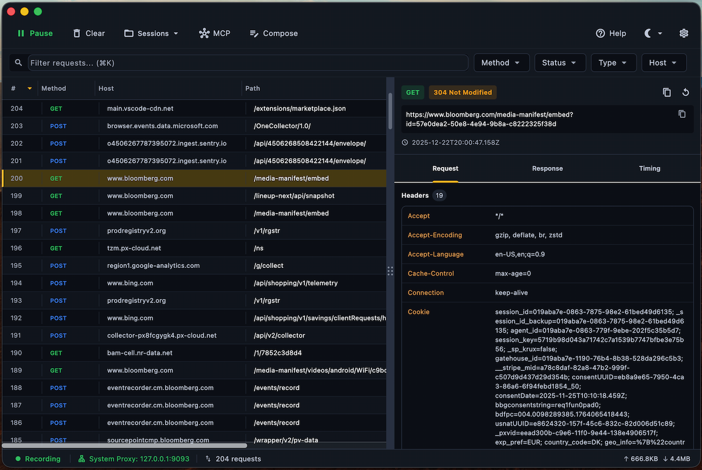
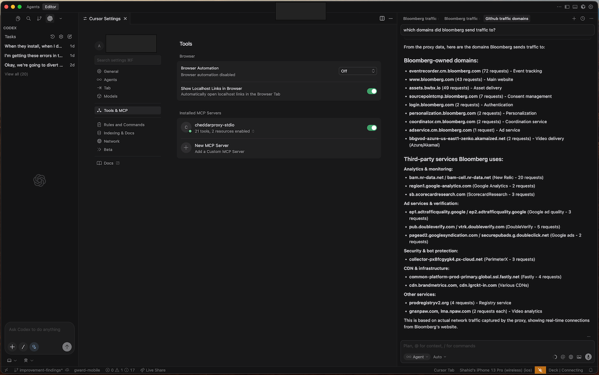

# Cheddar Proxy 

> 🔍 A free, open-source, cross-platform network traffic inspector for developers and AI agents.

[](https://opensource.org/licenses/MIT)
[](#)

---

## Demo






---

## Why Cheddar Proxy?

Existing tools like Fiddler, Proxyman, and Charles are either **paid**, **limited in free tiers**, or feel like **web apps wrapped in Electron**.

Cheddar Proxy is built with a different philosophy:

| Principle               | What It Means                                        |
| ----------------------- | ---------------------------------------------------- |
| **Zero-Config Startup** | Open the app → traffic appears. No wizards.          |
| **Native Feel**         | Flutter + Rust = fast, responsive, no web scrollbars |
| **AI-Native**           | Built-in MCP server so agents/IDEs can query traffic |
| **Free Forever**        | Open source (MIT). No paywalls. No "pro" tiers.      |

---

## Features

### Shipped

- ✅ HTTP/HTTPS traffic interception
- ✅ WebSocket capture and message inspection (connection list + frames)
- ✅ Request/response inspection with syntax highlighting
- ✅ Filter by host, path, method, status code
- ✅ Breakpoints - pause, inspect, modify requests
- ✅ Copy as cURL / code snippets
- ✅ Export sessions (HAR format)
- ✅ **Built-in MCP server** for AI agent integration (see below)

### Roadmap

- 🔜 HTTP/2 interception (library-backed; HTTP/3 deferred)
- 🔜 gRPC / GraphQL visualization (on top of HTTP/1.1 proxying and future h2)
- 🔜 Scripting (JavaScript/Python) to inspect/modify requests, responses, and WebSocket frames via hookable scripts
- 🔜 Map local / remote (redirect hosts/paths to local files or alternate upstreams)

---

## 🤖 AI Agent Integration (MCP)

**First network proxy with native MCP support** — Cheddar Proxy includes a built-in [Model Context Protocol](https://modelcontextprotocol.io/) server, enabling AI coding agents to query traffic, replay requests, and analyze network activity programmatically.

**Standards-based:** Implements the official MCP spec and uses the official [Rust MCP SDK](https://github.com/modelcontextprotocol/rust-sdk), so any MCP-compatible client can connect without custom adapters.

| Use Case                | What AI Agents Can Do                               |
| ----------------------- | --------------------------------------------------- |
| **Debug API issues**    | "Show me all failed requests to /api/users"         |
| **Export for analysis** | "Export the last 10 requests as HAR"                |
| **Replay & test**       | "Replay this request with modified headers"         |
| **Traffic monitoring**  | "Stream new requests matching host:api.example.com" |

**Works with:** Cursor, Claude Desktop, MCP Inspector, and any MCP-compatible client.

**Quick setup:** Open Settings → MCP tab → Click **"Add to Cursor"** to automatically configure.

---

## Architecture

```
┌──────────────────────────────────────────────────────────────────────────────┐
│                             Flutter UI Layer                                 │
│  ┌─────────────┐   ┌─────────────┐   ┌─────────────┐   ┌─────────────────┐   │
│  │ Traffic     │   │ Inspector   │   │ Breakpoint  │   │ Settings        │   │
│  │ List View   │   │ Panel       │   │ Manager     │   │ & Preferences   │   │
│  └─────────────┘   └─────────────┘   └─────────────┘   └─────────────────┘   │
├──────────────────────────────────────────────────────────────────────────────┤
│                      Flutter <-> Native Bridge                               │
│               (FFI for Rust | Platform Channels for OS APIs)                 │
├──────────────────────────────────────────────────────────────────────────────┤
│                             Core Engine (Rust)                               │
│  ┌─────────────┐   ┌─────────────┐   ┌─────────────┐   ┌─────────────────┐   │
│  │ Proxy       │   │ TLS         │   │ Protocol    │   │ Storage         │   │
│  │ Server      │   │ Interception│   │ Parsers     │   │ (SQLite)        │   │
│  │ (TCP/HTTP)  │   │ (Cert Gen)  │   │ (HTTP/WS)   │   │                 │   │
│  └─────────────┘   └─────────────┘   └─────────────┘   └─────────────────┘   │
│  ┌─────────────┐   ┌─────────────┐   ┌─────────────┐   ┌─────────────────┐   │
│  │ Breakpoint  │   │ Filter      │   │ Export      │   │ MCP Server      │   │
│  │ Engine      │   │ Engine      │   │ (HAR/cURL)  │   │ (AI Integration)│   │
│  └─────────────┘   └─────────────┘   └─────────────┘   └─────────────────┘   │
├──────────────────────────────────────────────────────────────────────────────┤
│                          Platform Adapters                                   │
│  ┌──────────────────┐   ┌──────────────────┐   ┌──────────────────┐          │
│  │ macOS            │   │ Windows          │   │ Linux            │          │
│  │ • System Proxy   │   │ • System Proxy*  │   │ • System Proxy   │          │
│  │ • Keychain       │   │ • Cert Store     │   │ • Cert trust TBD │          │
│  └──────────────────┘   └──────────────────┘   └──────────────────┘          │
└──────────────────────────────────────────────────────────────────────────────┘
```

- **UI**: Renders traffic with virtualization; lets you pause/edit via breakpoints; exports sessions.
- **Bridge**: Uses `flutter_rust_bridge` to call Rust APIs and stream updates to the UI.
- **Core**: Rust proxy with TLS interception, breakpoint pipeline, request replay, and HAR/cURL export.
- **MCP**: Local Model Context Protocol server so IDEs/agents can inspect/export traffic without the UI.
- **Storage**: SQLite (WAL) for sessions; bodies lazily loaded for performance.
- \*Windows system proxy automation is implemented but still undergoing validation across SKUs; manual proxy configuration may be needed.

See the detailed design in `docs/PROJECT_SPECIFICATION.md` for a deeper architecture walkthrough.

---

## Building

### Prerequisites

- Flutter 3.19+
- Rust 1.75+
- Platform SDKs (Xcode for macOS, Visual Studio for Windows)

### Development

```bash
# Clone the repo
git clone https://github.com/aman-shahid/cheddarproxy.git
cd cheddarproxy

# Build Rust core
cd core
cargo build --release

# Run Flutter app
cd ../ui
flutter run -d macos  # or -d windows
```

### Release verification

Before cutting a release, run the two integration suites that exercise the Rust proxy pipeline (including breakpoint edits) and the system proxy/certificate plumbing:

```bash
# In core
cargo test proxy::server::tests::handle_connection_persists_transaction_with_mock_connector
cargo test proxy::server::tests::breakpoint_resume_applies_request_edits

# In ui (may prompt for cache writes on first run)
flutter test test/core/utils/system_proxy_service_test.dart
```

These tests run fully in-process (no OS proxy changes) and are safe for CI/release pipelines.

## MCP access (IDE/agent integrations)

Cheddar Proxy exposes a local [Model Context Protocol](https://modelcontextprotocol.io/) server so IDEs and automation agents can start/stop the proxy, stream transactions, or export HAR files without touching the UI.

1. Launch the desktop app as usual and click the new **MCP** button in the top toolbar.
2. Toggle the switch to start the MCP server. The dialog shows the Unix socket path (copy button included) and lets you opt into "auto-enable on launch".
3. Point your MCP client (Cursor, Claude Desktop, MCP Inspector, etc.) at that socket, e.g. `mcp-inspector --server unix:/tmp/cheddarproxy-mcp.sock`.

The toggle reflects live status, so you can stop the server at any time or leave it running persistently for scripts/IDE extensions.

---

## Performance

Cheddar Proxy is engineered for speed and efficiency:

| Metric            | Value                             |
| ----------------- | --------------------------------- |
| **Proxy Latency** | ~2-5ms (local targets)            |
| **Throughput**    | ~950 req/s (remote), ~5k+ (local) |
| **Memory**        | 250-520 MB typical                |
| **UI Frame Rate** | 60 fps                            |

### Why It's Fast

- **Rust core**: Zero-copy parsing, async I/O, no GC pauses
- **Lazy loading**: Large bodies fetched only when viewed
- **Virtualized list**: Only visible rows rendered
- **Efficient storage**: SQLite with WAL mode

See [Performance Documentation](./docs/PERFORMANCE.md) for benchmarks and methodology.

### Run Benchmarks

```bash
# Throughput benchmark
./scripts/benchmark/benchmark_throughput.sh

# Latency comparison
./scripts/benchmark/benchmark_latency.sh

# Memory profiling
python3 ./scripts/benchmark/benchmark_memory.py --with-load
```

---

## Documentation

- [Project Specification](./docs/PROJECT_SPECIFICATION.md) - Full architecture and roadmap
- [Performance](./docs/PERFORMANCE.md) - Benchmarks and optimization details
- [Contributing](./CONTRIBUTING.md) - How to contribute
- [Building](./docs/BUILDING.md) - Detailed build instructions
- [Security](./SECURITY.md) - Vulnerability disclosure process
- [Third-Party Notices](./THIRD_PARTY_NOTICES.md) - Bundled dependencies and licenses

---

## AI-Assisted Development

This project was built with AI-assisted coding under human direction and review; design decisions, architecture, and testing were guided and validated by the maintainer.

---

## License

MIT License - see [LICENSE](./LICENSE) for details.

---

## Acknowledgements

Inspired by the excellent work of:

- [Proxyman](https://proxyman.io) - Beautiful native macOS UI
- [mitmproxy](https://mitmproxy.org) - Powerful open-source proxy
- [HTTP Toolkit](https://httptoolkit.tech) - Developer-focused HTTP debugging
